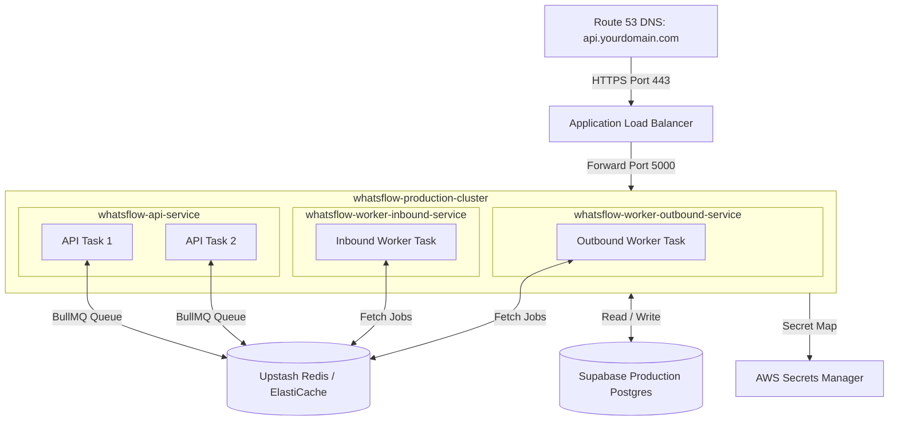

# WhatsFlow AI — AWS Production Deployment Guide

This guide details the step-by-step process to deploy the **WhatsFlow AI Backend** in a highly available, enterprise-grade production environment on **AWS (Amazon Web Services)**.

Based on your active AWS configuration, we will target:
* **AWS Region**: `eu-north-1` (Stockholm)
* **AWS Account ID**: `984312272694`
* **ECR Registry**: `984312272694.dkr.ecr.eu-north-1.amazonaws.com`
* **Backend Image Repo**: `whatsflow-backend`

We will leverage **Amazon ECS (Elastic Container Service) with AWS Fargate (Serverless)** to run our REST API and background Queue Workers without managing servers, fronted by an **Application Load Balancer (ALB)** for secure HTTPS and Route 53 domain mapping.

---

## AWS Deployment Architecture



---

## Step 1: Build & Push the Backend Image to AWS ECR

The backend image must be compiled and uploaded to your existing ECR repository. You can do this using your configured CodeBuild setup, or manually via the AWS CLI.

### Option A: Via Your Existing CodeBuild Pipeline
Your repository is pre-configured with a CodeBuild build spec.
1. Make sure your local modifications are zipped as `server.zip`.
2. Upload `server.zip` into the S3 bucket: `whatsflow-builds-984312272694/server.zip`
3. Go to the **AWS CodeBuild** Console → select project **`whatsflow-backend-build`** → Click **Start Build**.
4. The pipeline will automatically run `Dockerfile` checks, build the image, tag it, and push it to:
   `984312272694.dkr.ecr.eu-north-1.amazonaws.com/whatsflow-backend:latest`

### Option B: Manually Pushing via AWS CLI
Run these commands from your local console terminal:
1. **Authenticate Docker with ECR**:
   ```bash
   aws ecr get-login-password --region eu-north-1 | docker login --username AWS --password-stdin 984312272694.dkr.ecr.eu-north-1.amazonaws.com
   ```
2. **Build the Production Image**:
   Navigate to the `/server` folder containing the `Dockerfile` and execute:
   ```bash
   cd server
   docker build -t whatsflow-backend .
   ```
3. **Tag & Push the Image**:
   ```bash
   docker tag whatsflow-backend:latest 984312272694.dkr.ecr.eu-north-1.amazonaws.com/whatsflow-backend:latest
   docker push 984312272694.dkr.ecr.eu-north-1.amazonaws.com/whatsflow-backend:latest
   ```

---

## Step 2: Store Secrets in AWS Secrets Manager

To prevent placing sensitive connection strings in plain text inside Task Definitions, store them in **AWS Secrets Manager**:

1. Open the **AWS Secrets Manager Console** in `eu-north-1`.
2. Click **Store a new secret** → Select **Other type of secret**.
3. Create key/value secrets containing your production values:
   * `SUPABASE_SERVICE_ROLE_KEY`
   * `REDIS_URL` (Upstash connection string format `rediss://...`)
   * `ENCRYPTION_KEY` (AES-256 random 64-hex key)
   * `OPENAI_API_KEY`
   * `META_APP_SECRET`
   * `WHATSAPP_VERIFY_TOKEN`
   * `INTERNAL_API_KEY`
4. Name the secret: **`whatsflow/production/secrets`**

---

## Step 3: Configure AWS IAM Roles

Make sure you have a standard ECS Task Execution Role (`ecsTaskExecutionRole`) configured.
1. Open the **IAM Console** → **Roles**.
2. If `ecsTaskExecutionRole` is not present, create it with trusted entity **Elastic Container Service Task**.
3. Attach standard policy: **`AmazonECSTaskExecutionRolePolicy`** (grants ECR pull and CloudWatch logging permissions).
4. Add an inline policy granting **`secretsmanager:GetSecretValue`** to access `arn:aws:secretsmanager:eu-north-1:984312272694:secret:whatsflow/production/secrets-*` so Fargate containers can securely read environment variables at startup.

---

## Step 4: Define Fargate Task Definitions

Since the exact same ECR docker image represents all three Express and BullMQ runner processes, we will create **three separate Fargate Task Definitions** pointing to that same ECR image, but override the entry commands.

### 1. API Server Task Definition (`whatsflow-api`)
* **Launch Type**: Fargate
* **OS / Architecture**: Linux/X86_64
* **Task CPU**: `0.5 vCPU` (512 CPU units)
* **Task Memory**: `1 GB`
* **Task Execution Role**: `ecsTaskExecutionRole`
* **Container Name**: `api-server`
* **Image URI**: `984312272694.dkr.ecr.eu-north-1.amazonaws.com/whatsflow-backend:latest`
* **Port Mappings**: Port `5000` (TCP)
* **Environment Variables**:
  * `PORT` = `5000`
  * `NODE_ENV` = `production`
  * `NEXT_PUBLIC_SUPABASE_URL` = (Your Supabase URL)
  * `NEXT_PUBLIC_SUPABASE_ANON_KEY` = (Your Anon Key)
* **Secrets Mapping** (Reference Key from Secrets Manager):
  * `REDIS_URL` -> ValueFrom: `whatsflow/production/secrets:REDIS_URL`
  * `SUPABASE_SERVICE_ROLE_KEY` -> ValueFrom: `whatsflow/production/secrets:SUPABASE_SERVICE_ROLE_KEY`
  * `ENCRYPTION_KEY` -> ValueFrom: `whatsflow/production/secrets:ENCRYPTION_KEY`
  * `META_APP_SECRET` -> ValueFrom: `whatsflow/production/secrets:META_APP_SECRET`
  * `WHATSAPP_VERIFY_TOKEN` -> ValueFrom: `whatsflow/production/secrets:WHATSAPP_VERIFY_TOKEN`
  * `INTERNAL_API_KEY` -> ValueFrom: `whatsflow/production/secrets:INTERNAL_API_KEY`
  * `OPENAI_API_KEY` -> ValueFrom: `whatsflow/production/secrets:OPENAI_API_KEY`

### 2. Inbound Webhook Worker Task Definition (`whatsflow-worker-inbound`)
* **Launch Type / CPU / Memory**: Fargate, `0.25 vCPU`, `512 MB`
* **Task Execution Role**: `ecsTaskExecutionRole`
* **Container Name**: `worker-inbound`
* **Image URI**: `984312272694.dkr.ecr.eu-north-1.amazonaws.com/whatsflow-backend:latest`
* **Port Mappings**: *None* (Workers pull from Redis queues and do not accept ingress web traffic)
* **Environment Variables & Secrets**: (Duplicate all API variables/secrets mapped above)
* **Command Override**: `node,dist/workers/webhook.worker.js` *(This overrides the default API command, initiating the webhook processor instead!)*

### 3. Outbound Message Worker Task Definition (`whatsflow-worker-outbound`)
* **Launch Type / CPU / Memory**: Fargate, `0.25 vCPU`, `512 MB`
* **Container Name**: `worker-outbound`
* **Image URI**: `984312272694.dkr.ecr.eu-north-1.amazonaws.com/whatsflow-backend:latest`
* **Port Mappings**: *None*
* **Environment Variables & Secrets**: (Duplicate all API variables/secrets mapped above)
* **Command Override**: `node,dist/workers/outbound.worker.js` *(Initiates campaign dispatches and automation queue listeners!)*

---

## Step 5: Provision ECS Cluster & Host Services

### 1. Create the Cluster
1. Open the **Amazon ECS Console**.
2. Click **Create Cluster**.
3. Cluster Name: **`whatsflow-production-cluster`**.
4. Infrastructure: Choose **AWS Fargate (Serverless)**.
5. Click **Create**.

### 2. Deploy API Web Service (High Availability)
We front the API with an Application Load Balancer to load balance traffic across multiple availability zones and terminate SSL certificates.

1. Open **whatsflow-production-cluster** → Click **Deploy** under the **Services** tab.
2. Deployment Configuration:
   * **Family**: Select `whatsflow-api` task definition family.
   * **Service Name**: `whatsflow-api-service`
   * **Desired Tasks**: `2` (Running 2 tasks ensures high availability).
3. Load Balancing Configuration:
   * **Load Balancer Type**: Application Load Balancer (ALB).
   * **ALB Name**: Create a new ALB named `whatsflow-backend-alb` (exposing HTTP/HTTPS listeners).
   * **Target Group Name**: `whatsflow-api-tg` (Health Check Path set to `/health`, healthy threshold 2, interval 30s).
4. VPC & Security Groups:
   * Ensure tasks reside in **Public Subnets** (or Private subnets mapped with a NAT Gateway).
   * Configure Security Group to allow ingress TCP traffic on Port `5000` **only** from the ALB Security Group.

### 3. Deploy Background Worker Services
1. Open **whatsflow-production-cluster** → Deploy a Service.
   * **Family**: `whatsflow-worker-inbound`
   * **Service Name**: `whatsflow-worker-inbound-service`
   * **Desired Tasks**: `1` or `2` (No load balancer needed).
2. Repeat the deploy step for the outbound worker:
   * **Family**: `whatsflow-worker-outbound`
   * **Service Name**: `whatsflow-worker-outbound-service`
   * **Desired Tasks**: `1` or `2`.

---

## Step 6: DNS, SSL, and Domain Mapping (ACM & Route 53)

To secure client requests and WhatsApp API webhook packets, you must terminate SSL at the Application Load Balancer:

### 1. Request SSL Certificate
1. Open the **AWS Certificate Manager (ACM) Console** in `eu-north-1`.
2. Click **Request Certificate** → select **Request a public certificate**.
3. Domain Name: Enter `api.yourdomain.com` (or your custom subdomain, e.g. `api.whatsflow.ai`).
4. Select **DNS Validation** (Recommended) and validate it by adding the generated CNAME record inside Route 53 or your custom domain registrar.

### 2. Configure ALB HTTPS Listener
1. Open **EC2 Console** → **Load Balancers** → select `whatsflow-backend-alb`.
2. Under **Listeners and Rules**:
   * Click **Add listener**.
   * Protocol: **HTTPS** (Port 443).
   * Default Action: **Forward to Target Group** `whatsflow-api-tg`.
   * Secure listener settings: Choose the validated SSL certificate from ACM.
3. Configure HTTP (Port 80) to automatically redirect requests to HTTPS (Port 443) for bulletproof security.

### 3. Point Domain DNS to the ALB
1. Open the **AWS Route 53 Console** (or your domain provider).
2. Navigate to your Hosted Zone (e.g. `yourdomain.com`).
3. Click **Create record**:
   * Record Name: `api` (resolves to `api.yourdomain.com`)
   * Record Type: **A (Address Record)**
   * Toggle **Alias** to **ON**.
   * Route traffic to: **Alias to Application Load Balancer**.
   * Select Region: `eu-north-1`
   * Choose your Load Balancer: `whatsflow-backend-alb`.
4. Click **Create Records**. 

---

## Step 7: Post-Deployment Verification

Verify the entire AWS ECS infrastructure is working harmoniously by hitting the secure live load balancer:

1. **Verify Health Check Endpoint**:
   ```bash
   curl -i https://api.yourdomain.com/health
   ```
   **Expected Response:** `HTTP/1.1 200 OK` with verified database and Redis connections.
   
2. **Verify Load Balancer Target Group**:
   Open ECS Console → Target Groups → Check `whatsflow-api-tg`. Both tasks must display status **`Healthy`**.

3. **Monitor CloudWatch Logs**:
   Open CloudWatch Console → Log Groups → `/ecs/api-server`, `/ecs/worker-inbound`, and `/ecs/worker-outbound` to check for active system outputs and webhook logs.
