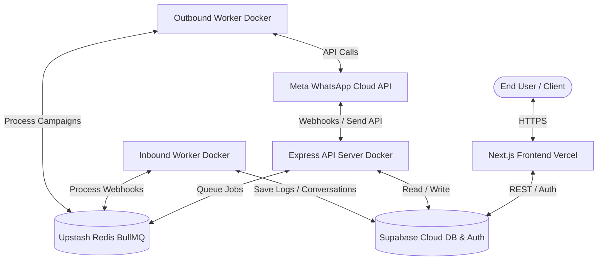

# WhatsFlow AI — Production Deployment Guide

This guide details the step-by-step production deployment process for the **WhatsFlow AI** application. 

WhatsFlow AI is a robust multi-tenant WhatsApp CRM & AI Automation platform. Its architecture consists of:
1. **Next.js Frontend**: Hosted serverless on Vercel.
2. **Node.js Express API & Queue Workers**: Dockerized and hosted on a VPS (Docker Compose) or cloud PaaS (Fly.io, Render).
3. **Database & Auth (Supabase)**: Managed Supabase Postgres database, Authentication, and private Storage.
4. **Queue Adapter (Redis)**: Managed Upstash Redis for BullMQ background jobs.

---

## Architecture Blueprint



---

## Phase 1: Database Setup (Supabase)

Supabase handles PostgreSQL, Multi-tenant Row Level Security (RLS), User Authentication, and media attachments.

### 1. Provision a New Supabase Project
1. Visit the [Supabase Dashboard](https://supabase.com/) and click **New Project**.
2. Select your Organization, Region, and set a strong Database Password. Keep this password safe.

### 2. Apply the Finalized Production Schema
1. Inside the Supabase Dashboard, navigate to the **SQL Editor** in the left navigation panel.
2. Click **New Query**.
3. Open the file `supabase_production_schema_final.sql` in your editor.
4. Copy the entire SQL content and paste it into the Supabase SQL editor.
5. Click **Run**. This will successfully create:
   - Core Database extensions (`pgcrypto`, `pg_trgm`, `vector` for AI embeddings).
   - All multi-tenant tables (Tenants, Profiles, Organizations, Contacts, Messages, AI Agents, KB).
   - Strict Row-Level Security (RLS) policies.
   - Performance Tuning indexes (including HNSW vectors & Trigram fuzzy name indices).
   - **Automated Provisioning Trigger**: When a new user signs up via Supabase Auth, this trigger automatically provisions a new Tenant, Organization bridge, Profile metadata, Free Billing Subscription, and a default AI Support Agent.

### 3. Configure Private Storage Bucket
1. Navigate to **Storage** on the Supabase menu.
2. Click **Create a new bucket**.
3. Name the bucket exactly: `chat-attachments`.
4. Ensure the bucket is set to **Private** (to restrict anonymous public access).
5. For production security, media attachments are accessed exclusively via authenticated signed URLs (1-hour expiry) generated programmatically by the server.

---

## Phase 2: Serverless Queue Setup (Upstash Redis)

WhatsFlow AI utilizes **BullMQ** for background job orchestration (webhook processing, outbound rate limiting, campaign dispatches, and retries). 

1. Sign up on [Upstash Redis](https://upstash.com/).
2. Create a new Serverless Redis Database.
3. Select your preferred Cloud Provider and Region (ideally matching your database or API host to minimize network latency).
4. Under **Settings**, set the **Eviction Policy** to **`noeviction`** (since it functions as a job queue, we must prevent memory overflow from randomly deleting unprocessed messages).
5. Copy the **Redis Connection URL** (in format `rediss://default:...`).

---

## Phase 3: Backend API & Queue Workers Deployment

The Express backend consists of three core runner roles:
1. **REST API Server** (Entry: `dist/index.js`): Handles HTTP routing, webhook receiving, and client authentication.
2. **Inbound Worker** (Entry: `dist/workers/webhook.worker.js`): Processes BullMQ webhook jobs asynchronously.
3. **Outbound Worker** (Entry: `dist/workers/outbound.worker.js`): Dispatches outgoing messages with built-in rate-limiting and metadata logging.

### Option A: VPS Hosting (Docker Compose — Recommended)
For cost efficiency and rapid scaling, you can host the entire backend suite on a single VPS (Ubuntu 22.04 LTS+) using the production-ready `docker-compose.yml` file.

1. Ensure Docker & Docker Compose are installed on the VPS:
   ```bash
   sudo apt-get update
   sudo apt-get install -y docker.io docker-compose-plugin
   ```
2. Git clone or upload the repository bundle onto the VPS.
3. Create a production environment file in `server/.env` (see the Environment Variables table below).
4. Initialize the Docker container swarm:
   ```bash
   docker compose up -d --build
   ```
5. Check your service health:
   ```bash
   docker compose ps
   docker compose logs -f api
   ```
6. Setup a reverse proxy (e.g. **Nginx** or **Caddy**) with SSL (Let's Encrypt) to map domain traffic (e.g. `https://api.whatsflow.ai`) to port `5000`.

### Option B: Managed PaaS (Fly.io, Render, Railway)
If you prefer not to manage a VPS, you can deploy the backend to a cloud Platform-as-a-Service:

1. **Deploy API Web Service**:
   - Create a Web Service connected to your repository.
   - Set Build Command to: `npm ci && npm run build` (running inside the `/server` folder context).
   - Set Start Command to: `node dist/index.js`.
   - Set Port to `5000` (API web port).
2. **Deploy Inbound Worker**:
   - Create a background Worker service.
   - Build Command: `npm ci && npm run build`
   - Start Command: `node dist/workers/webhook.worker.js`.
3. **Deploy Outbound Worker**:
   - Create a background Worker service.
   - Build Command: `npm ci && npm run build`
   - Start Command: `node dist/workers/outbound.worker.js`.

---

## Phase 4: Frontend Deployment (Next.js on Vercel)

Next.js is highly optimized for serverless performance on Vercel.

1. Sign up on [Vercel](https://vercel.com/) and link your GitHub account.
2. Click **Add New** → **Project**.
3. Select your repository.
4. Keep the Framework Preset as **Next.js** and build settings as default.
5. Expand the **Environment Variables** accordion and add all frontend environment keys (detailed in the configuration table below).
6. Click **Deploy**. Vercel will automatically build and assign a production URL (e.g., `https://whatsflow.ai`).

---

## Phase 5: Production Environment Variables

### 1. Backend Services Configuration (`server/.env`)
These must be populated in the API server environment:

| Env Variable | Required | Production Value & Setup Guide |
|--------------|----------|--------------------------------|
| `PORT` | Yes | `5000` (Port for REST API bindings) |
| `NODE_ENV` | Yes | `production` |
| `NEXT_PUBLIC_SUPABASE_URL` | Yes | Supabase Dashboard → Settings → API → Project URL |
| `NEXT_PUBLIC_SUPABASE_ANON_KEY` | Yes | Client-side anon key (Supabase dashboard API keys) |
| `SUPABASE_SERVICE_ROLE_KEY` | Yes | Bypasses Row Level Security safely for workers. Keep private! |
| `REDIS_URL` | Yes | Your Upstash serverless connection URL (`rediss://default:...`) |
| `ENCRYPTION_KEY` | Yes | AES-256-GCM symmetric key. Generate a random 64-hex string. |
| `INTERNAL_API_KEY` | Yes | Custom secret key used to validate secure internal microservice callbacks. |
| `WHATSAPP_VERIFY_TOKEN` | Yes | Custom string entered in Meta Developers Console to verify webhooks. |
| `META_APP_SECRET` | Yes | Found in Meta App Dashboard → Basic settings (used for HMAC security). |
| `OPENAI_API_KEY` | Yes | API Key from OpenAI platform (used for GPT-4o customer support agents) |
| `BULL_BOARD_USER` | Yes | Secure admin username to access Bull Board Queue UI |
| `BULL_BOARD_PASSWORD` | Yes | Secure admin password for Bull Board |

> [!WARNING]
> The `ENCRYPTION_KEY` is crucial. It is used to securely encrypt Meta WhatsApp tokens in the database. Changing it later will corrupt existing account links. Generate it securely in terminal:
> `node -e "console.log(crypto.randomBytes(32).toString('hex'))"`

### 2. Frontend Configuration (`.env.local` / Vercel Dashboard)
These must be added as environment variables inside Vercel:

| Env Variable | Required | Purpose |
|--------------|----------|---------|
| `NEXT_PUBLIC_SUPABASE_URL` | Yes | Supabase project URL |
| `NEXT_PUBLIC_SUPABASE_ANON_KEY` | Yes | Client anon key |
| `NEXT_PUBLIC_API_URL` | Yes | The secure endpoint of your backend, e.g., `https://api.whatsflow.ai` |
| `NEXT_PUBLIC_SITE_URL` | Yes | Your public frontend address, e.g., `https://whatsflow.ai` |

---

## Phase 6: Connecting Meta Developer Webhooks

Once both frontend and backend are successfully running, finalize the hook connection with Meta:

1. Log in to the [Meta App Console](https://developers.facebook.com/).
2. Navigate to your app dashboard → Click **WhatsApp** → **Configuration** (or Webhooks).
3. Click **Edit** on the Webhooks section:
   - **Callback URL**: Enter `https://YOUR_API_DOMAIN/api/webhooks/whatsapp`
   - **Verify Token**: Paste the exact string value you assigned to `WHATSAPP_VERIFY_TOKEN` in your environment variables.
4. Click **Verify and Save**.
5. Locate the list of webhook fields and click **Subscribe** on **`messages`** and **`message_deliveries`**.

---

## Phase 7: Post-Deployment Verification

Verify system integrations using simple API checks:

### 1. Health & Queue Status Check
Run a request against the public backend health check.
```bash
curl -i https://YOUR_API_DOMAIN/health
```
**Expected Response:** `HTTP/1.1 200 OK` with JSON:
```json
{
  "status": "ok",
  "database": "connected",
  "redis": "connected"
}
```

### 2. Security Handshake Verification
Attempt to hit the diagnostic API to verify production environment safety (which must block access):
```bash
curl -i https://YOUR_API_DOMAIN/api/diagnostic
```
**Expected Response:** `HTTP/1.1 404 Not Found` (in production, diagnostics are hidden).

### 3. Webhook Integrity Handshake
Simulate an unauthorized Whatsapp Webhook ping with an invalid signature:
```bash
curl -i -X POST https://YOUR_API_DOMAIN/api/webhooks/whatsapp \
  -H "Content-Type: application/json" \
  -H "x-hub-signature-256: sha256=invalidsignature" \
  -d "{}"
```
**Expected Response:** `HTTP/1.1 401 Unauthorized` (confirming HMAC verify functions correctly protect API from spoof pings).
