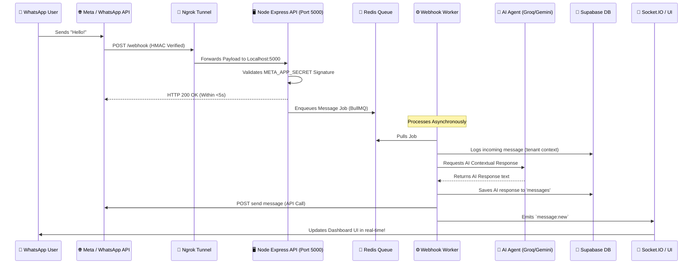

# 🚀 Comprehensive Ngrok Setup & QA Matrix
This guide provides step-by-step instructions to expose your local WhatsFlow AI backend using **Ngrok** and thoroughly QA all platform features.

---

## 📋 Table of Contents
1. [System Architecture Diagram](#-system-architecture)
2. [Phase 1: Environment Configuration](#-phase-1-environment-configuration)
3. [Phase 2: Exposing Backend with Ngrok](#-phase-2-exposing-backend-with-ngrok)
4. [Phase 3: Meta Developer Portal Setup](#-phase-3-meta-developer-portal-setup)
5. [Phase 4: Running the Stack](#-phase-4-running-the-stack)
6. [Phase 5: Feature QA Checklist & Test Cases](#-phase-5-feature-qa-checklist--test-cases)

---

## 🌌 System Architecture

The following flowchart details how an external WhatsApp message traverses Ngrok to reach your local stack:



---

## 🛠 Phase 1: Environment Configuration

Before running Ngrok, ensure the **Express Backend Environment** (`server/.env`) is fully completed. If any are missing, the server will fail pre-flight validations.

### Required Variable Checklist (in `d:/whatsapp/server/.env`)
- [ ] `PORT=5000`
- [ ] `SUPABASE_URL` & `SUPABASE_SERVICE_ROLE_KEY`
- [ ] `ALLOWED_ORIGIN=http://localhost:3000` (CORS allowed frontend origin)
- [ ] `META_APP_SECRET` *(⚠️ CRITICAL: Retrieve from App Basic Dashboard)*
- [ ] `WHATSAPP_ACCESS_TOKEN`
- [ ] `WHATSAPP_PHONE_NUMBER_ID`
- [ ] `WHATSAPP_VERIFY_TOKEN` *(Choose a secure string like `whatsflow_local_qa`)*
- [ ] `GROQ_API_KEY` & `OPENROUTER_API_KEY` (For LLM features)

---

## 🔗 Phase 2: Exposing Backend with Ngrok

To receive webhooks from Facebook servers, your local port `5000` must have a public HTTPS address.

### Step 1: Initialize the Ngrok Tunnel
Run the following command in an independent Terminal window:

```bash
# Option A: If you have Node.js installed (Quickest method)
npx ngrok http 5000

# Option B: If you have Ngrok installed globally
ngrok http 5000
```

> [!IMPORTANT]
> Modern versions of Ngrok require a **free authtoken** to work properly. If prompted, sign up at [ngrok.com](https://ngrok.com), get your token, and run:
> `npx ngrok config add-authtoken YOUR_TOKEN_HERE`

### Step 2: Extract the Public URL
Look at the console output. Locate the **Forwarding** line:
```text
Forwarding  https://abcd-123-456.ngrok-free.app -> http://localhost:5000
```
*Copy that public HTTPS URL (e.g. `https://abcd-123-456.ngrok-free.app`).*

---

## 🛡 Phase 3: Meta Developer Portal Setup

Configure Meta to send your development WhatsApp activities through Ngrok.

1. Navigate to the [Meta Developer Portal](https://developers.facebook.com/) and select your application.
2. In the sidebar, navigate to **WhatsApp** -> **Configuration**.
3. Click **Edit** under **Webhook Configuration**:
   - **Callback URL**: `https://[YOUR-NGROK-SUBDOMAIN].ngrok-free.app/webhook`
   - **Verify Token**: Paste the exact string defined in `WHATSAPP_VERIFY_TOKEN` (inside `server/.env`).
4. Click **Verify and Save**. 
   *(If successful, your backend terminal logs will say `[webhook] Meta verification handshake accepted`.)*
5. Under **Webhook Fields**, ensure you click **Subscribe** for:
   - `messages`

---

## ⚙️ Phase 4: Running the Stack

To thoroughly test features, **four** separate components must be active:

### 🟢 Startup Options

#### Option A: The Manual Stack (Highly Recommended for Logs/Debugging)
Open 4 terminal tabs and run the following commands:

| Component | Working Directory | Command |
| :--- | :--- | :--- |
| 1️⃣ **Database & Cache** | Root | Verify Redis container is running (`docker compose up -d redis`) |
| 2️⃣ **API Gateway** | `/server` | `npm run dev` |
| 3️⃣ **Inbound Queue Worker** | `/server` | `npm run worker` |
| 4️⃣ **Outbound Sender Worker** | `/server` | `npm run worker:outbound` |

#### Option B: The Docker Stack (One Command)
Build and start the whole backend automatically:
```bash
docker compose up -d api worker-inbound worker-outbound redis
```

---

## 🧪 Phase 5: Feature QA Checklist & Test Cases

Walk through this checklist manually to guarantee features are working perfectly before moving to staging/production.

### 📍 Test Series 100: Webhook & Auth Integrations

| Test ID | Feature Name | Test Steps | Expected Result | Status |
| :--- | :--- | :--- | :--- | :---: |
| **T-101** | **Handshake Validation** | Enter Callback URL & Token in Meta console. Click Verify. | Meta saves successfully; Status 200 logged. | `Pending` |
| **T-102** | **Signature Authentication** | Try hitting `POST /webhook` via Postman without `x-hub-signature-256` header. | Returns `HTTP 403 Forbidden`. Prevents spoofing! | `Pending` |

### 📍 Test Series 200: Messaging Lifecycle (The Core Loop)

| Test ID | Feature Name | Test Steps | Expected Result | Status |
| :--- | :--- | :--- | :--- | :---: |
| **T-201** | **Inbound Capture** | Send "Hello, WhatsFlow" from a personal WhatsApp to your Test Number. | Webhook captures raw payload, returns 200 OK under 5 seconds. | `Pending` |
| **T-202** | **Background Queue** | Send a high volume (5-10) of messages rapidly. | Messages are added to Redis Queue (`BullMQ`) instantly without duplicates. | `Pending` |
| **T-203** | **DB Sync** | Check `messages` & `conversations` tables in Supabase. | Raw message, timestamp, and sender profile persisted accurately. | `Pending` |

### 📍 Test Series 300: AI Orchestrations

| Test ID | Feature Name | Test Steps | Expected Result | Status |
| :--- | :--- | :--- | :--- | :---: |
| **T-301** | **AI Triggering** | Set bot status to "AI Active" and message the bot a question. | `webhook.worker.ts` calls LLM provider. Saves reply. | `Pending` |
| **T-302** | **Agent Fallbacks** | Force Groq to fail (corrupt API key) and test message handling. | Fallback to secondary LLM succeeds or gracefully alerts user. | `Pending` |

### 📍 Test Series 400: Dashboard & Socket Real-time

| Test ID | Feature Name | Test Steps | Expected Result | Status |
| :--- | :--- | :--- | :--- | :---: |
| **T-401** | **Live Chat Sync** | Open the Live Chat Dashboard (`localhost:3000/dashboard/conversations`) and send a message to the bot. | Conversation list highlights, and message appears instantly without page refresh. | `Pending` |
| **T-402** | **Manual Send** | Type a message in the dashboard live chat input and hit send. | Outbound worker executes, user receives reply on actual WhatsApp device. | `Pending` |

---

## 🔍 Troubleshooting Common QA Blockers

- **Error: `Missing required environment variables`**
  - *Solution*: Ensure all variables under Phase 1 are present in `/server/.env` and the server is restarted.
- **Error: `Redis connection refused`**
  - *Solution*: Verify Redis is running on local port `6379`. Use `docker compose up -d redis` to start it instantly.
- **Error: `502 Bad Gateway` on Ngrok**
  - *Solution*: The tunnel is alive, but your backend server (`npm run dev` on port 5000) is not running.
- **Meta Says: `Verify Token could not be validated`**
  - *Solution*: Ensure Ngrok HTTPS URL is spelled correctly and that the backend server is actually running. Check backend console for validation error printouts.
- **Duplicate Messages Executed**
  - *Solution*: Ensure you have only **ONE** instance of `worker.ts` running locally to avoid concurrent processing overlaps, or ensure Redis lock deduplication is enabled.
