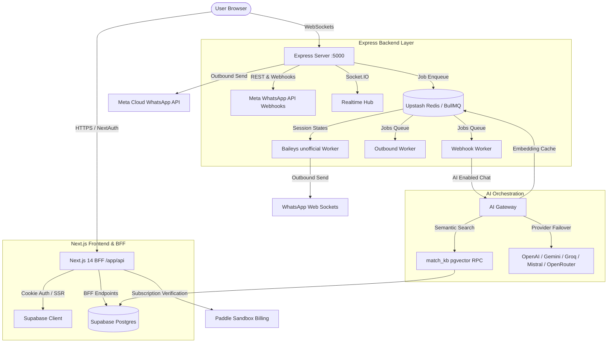

# WhatsFlow AI — System Architecture & Development Roadmap Report

This document provides a comprehensive technical audit of the **WhatsFlow AI** system. It details the existing architecture, identifies current strengths, and provides a clear, prioritised roadmap of **what needs to be developed** to take this WhatsApp lead-conversion SaaS platform from its current QA/staging state into a hardened, highly scalable production environment.

---

## 🗺️ High-Level System Architecture

WhatsFlow AI utilizes a hybrid architecture split between a **Next.js BFF (Backend-for-Frontend)** for user interactions and a high-throughput **Express/Node.js backend** with **Redis & BullMQ** for real-time Webhook handling, background message queuing, and AI agent execution.



---

## 🏗️ 1. Current System Capabilities (What is Built)

The core layers of WhatsFlow AI are already structured and functional, as validated in the recent QA audit release:

### 💻 A. Frontend Dashboard & BFF (Next.js 14)
* **Real-time Unified Inbox**: Displays user conversations and allows live agent-to-customer messaging synced over Socket.IO.
* **Leads Kanban/CRM**: Provides structured lead tracking with custom pipeline stages.
* **Campaign Manager**: Allows creating and broadcasting outbound message templates.
* **WhatsApp Flow Builder**: Visual flow configurator stored dynamically inside a Postgres JSONB schema (`chatbot_flows`).
* **Subscription Management**: Integral Paddle Sandbox integration mapping Starter, Growth, and Scale billing tiers to tenant limits.

### ⚙️ B. Express Server & Background Processing
* **Rate Limiting**: Fail-closed Upstash Redis middleware that intercepts and limits incoming requests based on tenant IDs.
* **BullMQ Queue Management**:
  * `webhook.worker.ts`: Decongests incoming WhatsApp messages so that Meta's webhook does not time out while LLM reasoning is occurring.
  * `outbound.worker.ts`: Manages and throttles outgoing messages to comply with Meta's messaging limits.
  * `baileys.worker.ts`: Handles QR code generation and socket-level message polling for clients using the unofficial WhatsApp Web integration.

### 🧠 C. The AI Orchestration Gateway (`services/ai-gateway.ts`)
* **Multi-LLM Fallback Pipeline**: Standardizes requests to OpenAI, Gemini, Groq, Mistral, and OpenRouter, implementing a graceful fallback pattern if the primary provider experiences a rate-limit error.
* **RAG Vector Search**: Embeds user query context using OpenAI `text-embedding-ada-002` and invokes the native Supabase `match_kb` `pgvector` function to pull up to 3 relevant context chunks.
* **Semantic Embedding Cache**: Implemented a 1-hour tenant-scoped Upstash Redis cache for identical user text embeddings to prevent unnecessary OpenAI API cost spikes.
* **Safe Input Redaction**: Basic regex prompt-injection guarding to filter hazardous system instructions.

---

## 🛠️ 2. Gaps & Missing Features (What Needs to be Developed)

To ensure this system can run reliably under high concurrent user load, protect sensitive corporate databases, and avoid unexpected operational expenses, the following roadmap details **exactly what must be developed next**.

### 📈 A. Architectural & Scalability Upgrades

> [!WARNING]
> **Critical Bottleneck: Baileys inside the main API server process.**
> Currently, the unofficial WhatsApp Baileys integration runs inside the Express API container. Managing multiple socket sessions and connection pooling inside a single process risks total downtime and OOM (Out of Memory) crashes if one session experiences high traffic or memory leaks.

#### 📋 Development Requirements:
1. **Decouple Baileys to a Dedicated Microservice**:
   * Build a separate Node.js container (`baileys-service`) that operates exclusively as a stateless Baileys instance runner.
   * Commits session JSON payloads to Supabase encrypted storage, and relays connection states back to the Express master instance via Redis Pub/Sub.
2. **Database Schema Cleanup (Unified Multi-Tenancy)**:
   * **Deprecate `profiles.organization_id`**: Legacy tables use `organization_id`, whereas the current edge middleware and authentication endpoints use the multi-tenant `tenant_members.tenant_id`.
   * **Develop a Postgres Migration Script**: Extract all existing data, map legacy organizations to new tenants, and enforce a cascading foreign key constraint on `tenant_members.tenant_id`.

---

### 🛡️ B. AI System Hardening & Safety

> [!IMPORTANT]
> **Cost & Prompt Injection Risks**
> Currently, the AI system lacks real-time cost-tracking or spend limits, and its prompt injection guard is based purely on basic regex strings which are trivial to bypass with modern jailbreak techniques.

```
AI Message Pipeline → [Regex Injection Guard] ❌ (Brittle) → [AI Gateway] → [No Spend Cap Check] ❌ (Risky)
```

#### 📋 Development Requirements:
1. **Implement an AI Token/Spend Budgeting System**:
   * **Develop Redis-based Token Counters**: Implement an active rate limiter that aggregates daily token usage (input + output tokens returned from OpenAI/Gemini) per tenant.
   * **Add Hard Spend Caps**: Read the `AI_DAILY_TOKEN_BUDGET` environment variable and reject new automated replies for a tenant once their daily quota is exhausted.
2. **Deploy an Advanced LLM Input Classifier (AI Guardrail)**:
   * Replace the regex-based check in `services/ai-gateway.ts` with a lightweight, local or high-speed classifier model (such as Llama Guard via Groq or a prompt classification schema on Gemini Nano/Flash) to identify prompt jailbreaks or PII leaks before sending them to the core LLM engine.
3. **Construct a "Human Handoff" Workflow**:
   * **State Management**: If a customer explicitly requests a human, or if the AI Gateway returns a low confidence score, update the database record (`leads.ai_active = false`).
   * **Notification**: Immediately broadcast a real-time event via Socket.IO to notify the dashboard inbox, giving agents a visual alert that manual intervention is required.

---

### 💳 C. Billing & Commercial Integrations

While Paddle Checkout works inside the sandbox, several webhook handling routines need to be hardened to prevent revenue leaks or incorrect session cancellations.

#### 📋 Development Requirements:
1. **Robust Paddle Webhook Processing**:
   * Establish verification checks on Paddle's asymmetrical webhook signatures (`pdl_ntfset...`) using the Paddle Node SDK.
   * Write background workers that map Paddle payload events (`subscription.created`, `subscription.updated`, `subscription.canceled`) to corresponding database actions.
2. **Graceful Downgrade Actions**:
   * If a tenant's subscription expires, write a database trigger or script to automatically:
     * Toggle `ai_active = false` across all contacts.
     * Deactivate automated WhatsApp Flows exceeding their free-tier threshold.

---

### 🧪 D. QA, Testing, & Monitoring

The current test suite consists of 8 unit tests, but lacks comprehensive visual, E2E, or infrastructure validation.

#### 📋 Development Requirements:
1. **Create an End-to-End (E2E) Test Suite with Playwright**:
   * Implement UI integration tests covering:
     * Authentication flows & workspace switcher.
     * Unified Inbox real-time message sync.
     * Flow Builder step creation and saving.
2. **Paddle & Webhook Mock Engines**:
   * Construct a mock webhook server inside the `tests/` directory to simulate Meta WhatsApp webhooks (incoming text, images, location data) and Paddle callback payloads.
3. **Production Ops Configuration**:
   * Create a production-grade `fly.toml` file with setup instructions for zero-downtime rolling deploys.
   * Configure comprehensive structured health endpoints (`/healthz` and `/livez`) checking both Postgres pool connections and Redis socket connectivity.

---

## 📅 3. Actionable Development Roadmap (Next Sprint Plan)

The following high-priority matrix categorizes the development objectives for the upcoming sprints:

| Phase | Category | Task Description | Target File / Area | Priority |
| :--- | :--- | :--- | :--- | :---: |
| **Phase 1** | **Architectural / Scale** | Decouple Baileys unofficial integration into a distinct container | `server/src/workers/baileys.worker.ts` | **P0 - Blocker** |
| **Phase 1** | **Security / Cost** | Add daily tenant AI spend limits and token counting in Redis | `services/ai-gateway.ts` | **P0 - Blocker** |
| **Phase 2** | **Billing** | Write Paddle Webhook routing for subscriptions lifecycle management | `app/api/webhooks/paddle/route.ts` | **P1 - High** |
| **Phase 2** | **AI Safety** | Integrate Llama Guard/Classifier to replace regex injection blocker | `services/ai-gateway.ts` | **P1 - High** |
| **Phase 2** | **Core UX** | Build human handoff UI button and automate `ai_active` toggling | `components/dashboard/ConversationViewer.tsx` | **P1 - High** |
| **Phase 3** | **Testing** | Implement E2E Playwright tests for Authentication and Inbox | `e2e/playwright/` | **P2 - Medium** |
| **Phase 3** | **Data Integrity**| Run schema migration to fully deprecate `profiles.organization_id` | `supabase/migrations/` | **P2 - Medium** |
| **Phase 3** | **DevOps** | Write production `fly.toml` configuration and set up Sentry alerting | Root directory / Ops | **P2 - Medium** |

---

### 📌 Summary of Development Requirements Checklist
- [ ] **Infrastructure**: Decouple Baileys websocket execution from the main Node.js web server.
- [ ] **AI Safety**: Enforce token spend caps via Redis + replace fragile regex prompt injection guards with a proper LLM model classifier.
- [ ] **Workflow UX**: Implement human handoff mechanics that deactivate the AI assistant and alert operators.
- [ ] **Commercials**: Complete production-ready Paddle billing webhook pipelines.
- [ ] **Testing**: Create an E2E Playwright test suite for critical user paths and webhook simulators.

*Compiled and analysed based on WhatsFlow AI codebase layout and security standards.*
